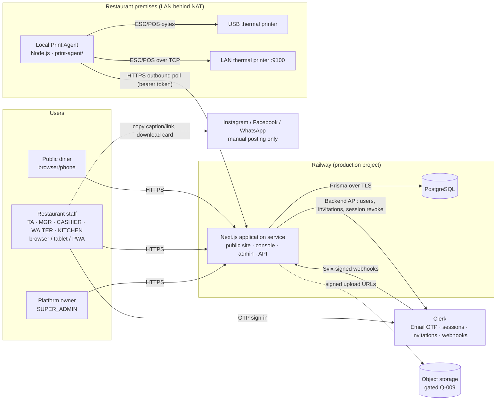
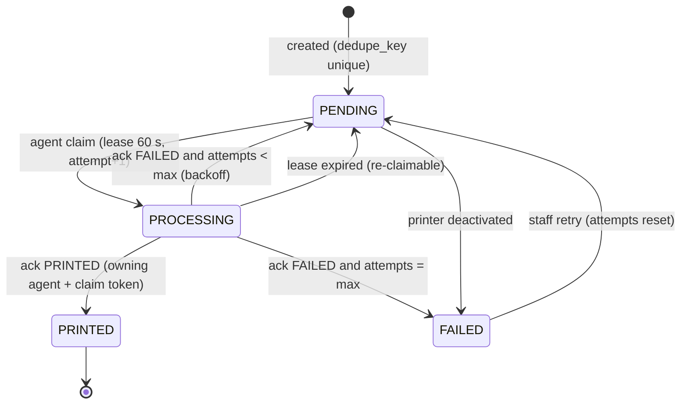

# SLICE-01 Architecture

## 1. Technology baseline

| Concern | Choice | Decision | Installed (2026-09-15) [fact] |
|---|---|---|---|
| Framework | Next.js App Router, Server Components, Server Actions, Route Handlers | ADR-001 | `next` 15.5.25, `react` 19.3.0 |
| Language | TypeScript strict | ADR-001 | `typescript` 5.9.3 |
| Authentication | Clerk, Email OTP | ADR-001, ADR-006 | `@clerk/nextjs` 6.39.6 |
| Database | PostgreSQL (Railway managed) | ADR-001 | version to confirm in S1-P02-T001 |
| ORM | Prisma | ADR-001 | `prisma`/`@prisma/client` 6.19.3 |
| Validation | Zod | baseline | `zod` 3.25.76 |
| Styling | Tailwind CSS + CSS variables | CLAUDE.md | `tailwindcss` 3.4.19 |
| Icons | lucide-react | baseline | 0.475.0 |
| Unit/integration tests | Vitest | ADR-001 | `vitest` 3.2.7 |
| E2E | Playwright | CLAUDE.md | **not installed** — S1-P01-T005 |
| Hosting | Railway | ADR-001 | not provisioned in repo — S1-P01-T008 / P27 |
| Printing | PostgreSQL queue + local agent | ADR-004, ADR-007 | agent not built — P17 |
| CI | GitHub Actions (repository hosted at `github.com/productsmy385-spl/RasoiOS` [fact: `git remote -v`]) | [proposed] S1-P01-T006 | absent |

No other runtime infrastructure (Redis, queues, WebSocket servers, third-party realtime or email providers) is used in SLICE-01.

## 2. System context



External integrations in SLICE-01:

| System | Direction | Purpose |
|---|---|---|
| **Clerk** | bidirectional | Email OTP authentication, invitations and webhooks |
| **Railway** | — | Hosting and PostgreSQL |
| **GitHub** | — | Source and CI |
| **Object storage** | outbound | Pending **Q-009** |
| **Email** | — | Clerk sends OTP and invitation emails. There is no application email provider. |
| **Social platforms** | none | No API integration (Q-012); staff post manually |

## 3. Logical architecture

```
                 ┌──────────────────────── Browser / PWA ────────────────────────┐
                 │  Public site (light)   Console (dark)   Kitchen (focus)   Admin │
                 └────────────────────────────────┬──────────────────────────────┘
                                                  │ HTTPS
┌─────────────────────────────── Next.js application (Railway) ───────────────────────────────┐
│ middleware.ts          Clerk session gate (non-public), x-request-id, security headers       │
│ ─────────────────────────────────────────────────────────────────────────────────────────── │
│ app/** (presentation)  Server Components (loaders) · Server Actions · Route Handlers         │
│                        each entry: require{Tenant|Platform|Agent}(permission) + Zod .strict()│
│ ─────────────────────────────────────────────────────────────────────────────────────────── │
│ lib/auth               session.ts (Clerk→USER) · context.ts (Tenant/Platform ctx) ·          │
│                        agent.ts (token→AgentContext) · permissions.ts (catalogue)            │
│ lib/validation         shared Zod schemas (UI + server)                                      │
│ lib/services           business rules, state machines, pricing, transactions, audit calls   │
│   orders · kot · transactions · menu · daily-menu · customers · staff · tenants · restaurant│
│   printing · print-agents · reports · social · dashboard · media                            │
│ lib/pricing            Decimal pricing & tax (ADR-010) — pure functions                     │
│ lib/time               restaurant timezone, business date, opening hours (Intl)             │
│ lib/print              PrintDocument renderers (KOT, receipt, test)                          │
│ lib/audit              write (in-tx), redact, action catalogue                               │
│ lib/security           rate-limit · origin · url allowlist                                   │
│ lib/data               THE ONLY Prisma access for tenant-owned models (ADR-008)              │
│ lib/db/prisma.ts       Prisma client singleton                                               │
│ lib/logger.ts · lib/errors.ts · lib/env.ts                                                   │
└──────────────────────────────────────────────┬──────────────────────────────────────────────┘
                                               │ TLS
                                        PostgreSQL (composite FKs, CHECKs, audit trigger)
```

### 3.1 Dependency rules (enforced by static tests in `tests/static/`)

| From | May import | Must not import |
|---|---|---|
| `app/**` | `lib/auth`, `lib/services`, `lib/validation`, `lib/ui`, `components/**` | `lib/data`, `lib/db`, `@prisma/client` runtime |
| `components/**` | `lib/ui`, `lib/validation` (types/schemas), other components | anything server-only |
| `lib/services/**` | `lib/data`, `lib/pricing`, `lib/time`, `lib/print`, `lib/audit`, `lib/security`, `lib/errors`, `lib/logger` | `app/**` |
| `lib/data/**` | `lib/db`, `lib/errors` | `lib/services`, `app/**` |
| `print-agent/**` | its own modules + shared `lib/print/types.ts` | anything from the Next.js app runtime |

## 4. Application areas

| Area | Routes | Primary actors | Key services |
|---|---|---|---|
| Public website | `/r/[slug]`, `/r/[slug]/daily`, cards, OG images | Diners | `lib/data/public.ts`, `lib/time` |
| Super Admin | `/admin/*` | SUPER_ADMIN | `lib/services/tenants.ts` |
| Tenant console | `/restaurant/*` | Tenant roles | all tenant services |
| Kitchen | `/restaurant/kitchen` | KITCHEN (+ TA/MGR) | `kot.ts`, `orders.ts` |
| Print queue | server side of printing | system, agent | `printing.ts`, `print-agents.ts`, `lib/print` |
| Local Print Agent | `print-agent/` package on restaurant PC | PRINT_AGENT credential | agent runtime |
| Operations | `/api/health`, `/api/ready`, webhooks | Railway, Clerk | `lib/env.ts`, `lib/logger.ts` |

## 5. Key flows

### 5.1 Staff order creation → kitchen → print

```mermaid
sequenceDiagram
    autonumber
    actor W as Waiter (tablet)
    participant A as SA-ORD-01 createOrderAction
    participant C as lib/auth/context
    participant S as lib/services/orders
    participant P as lib/pricing
    participant D as lib/data (Prisma)
    participant DB as PostgreSQL
    actor AG as Print Agent
    W->>A: {idempotencyKey, items[variantId, addonIds, qty], sendToKitchen:true}
    A->>C: requireTenant("order:create") (+ "order:accept")
    C->>DB: USER, USER_TENANT ACTIVE, TENANT ACTIVE
    A->>A: Zod .strict() (no price/total/tenant keys)
    A->>S: createOrder(ctx, input)
    S->>DB: BEGIN
    S->>D: existing order by (tenant, idempotencyKey)? → return it
    S->>D: load items/variants/addons WHERE tenant_id = ctx.tenantId (published, available)
    S->>P: price lines (Decimal, ROUND_HALF_UP)
    S->>D: TENANT_COUNTER ORDER (business_date in restaurant tz) → order_number
    S->>D: INSERT order, order_items, order_item_addons
    S->>D: status → ACCEPTED; KOT per (section, round) + KOT_ITEMs; TENANT_COUNTER KOT
    S->>D: PRINT_JOB per KOT (printer by section, dedupe_key KOT:{id}:v1) if auto_print_kot
    S->>D: AUDIT_LOG order.created, order.status_changed, kot.generated
    S->>DB: COMMIT
    A-->>W: {orderNumber, totals (authoritative)}
    loop every ~3 s
      AG->>DB: RH-AGT-03 claim (FOR UPDATE SKIP LOCKED, lease 60 s)
    end
    AG->>AG: encode ESC/POS, write to printer
    AG->>DB: RH-AGT-04 ack PRINTED (claim token)
```

If the transaction fails, nothing is persisted, including no KOT or print job (this fixes BA-15). If no printer is configured for a section, the KOT is
still created and shown on the kitchen board, and the order detail shows "No printer configured". This is not treated as an error.

### 5.2 Kitchen status progression

1. The kitchen board polls `RH-KOT-01` every 5 s (ADR-009).
2. The cook presses **Start**, which calls `SA-KOT-01` (→ PREPARING). The service moves the order ACCEPTED → PREPARING when this is the first KOT.
3. The cook presses **Ready**, which calls `SA-KOT-01` (→ READY). When every KOT in the latest round is READY or SERVED, the order moves to READY.
4. The waiter or cashier sees READY on the order board and marks the KOT **Served**. After payment, the order moves to COMPLETED (`order:complete`, requires PAID).

### 5.3 Payment and reconciliation

1. `SA-TXN-01` locks the order row (`SELECT … FOR UPDATE`), then computes the outstanding balance from the ledger.
2. It inserts a PAYMENT row and recomputes `paid_amount` and `payment_status` in the same transaction, with audit.
3. `SA-TXN-04` day close computes expected totals from ledger rows with that `business_date`, stores counted cash and variance, and locks the date against further ledger writes.

### 5.4 Public website read

1. `/r/[slug]` loads through `lib/data/public.ts`: tenant ACTIVE, `website_published`, public projection only.
2. The page is rendered with ISR (`revalidate: 60`). Menu, website and daily-menu publishing actions call `revalidatePath("/r/"+slug)`.
3. "Open now" and today's daily menu are computed from `RESTAURANT.timezone` at render time. The 60 s revalidation bounds staleness at day boundaries.
   The `OpenNowBadge` also recomputes client-side from the hours payload.

### 5.5 Onboarding a tenant

1. SUPER_ADMIN runs `SA-ADM-01`, which creates TENANT, RESTAURANT and an INVITED TENANT_ADMIN, then sends a Clerk invitation.
2. The admin accepts the invitation and completes OTP. The session resolver links `clerk_user_id` and activates the membership.
3. The dashboard onboarding checklist guides them through: profile → hours → timezone/currency → kitchen sections → categories/items → publish website → pair print agent → add printers.

## 6. Print subsystem

### 6.1 Components

| Component | Location | Responsibility |
|---|---|---|
| Print job producer | `lib/services/printing.ts` | Create PRINT_JOB rows inside business transactions (KOT, receipt, test); resolve target printer |
| Renderer | `lib/print/render-kot.ts`, `render-receipt.ts`, `render-test.ts` | Build `PrintDocument` from snapshots; sanitize text (SC-VAL-07); enforce width |
| Queue access | `lib/data/print-jobs.ts` | Claim with lease, ack, retry/backoff, dedupe |
| Agent API | `app/api/v1/print-agent/**` | Pair, heartbeat, config, claim, ack (ADR-007) |
| Console | `/restaurant/printing` | Printers, agents, queue, retries |
| Local agent | `print-agent/` | Poll, encode ESC/POS, write to USB/LAN, journal, retry, health |

### 6.2 Printer routing

| Job | Target printer selection |
|---|---|
| KOT for section S | Active printer with purpose KOT or KOT_AND_RECEIPT and `kitchen_section_id = S`. If none, a printer with `kitchen_section_id IS NULL` and KOT purpose. If none, no job is created and the KOT shows `printStatus: NONE`. |
| Receipt | Active printer with purpose RECEIPT or KOT_AND_RECEIPT (the first by name if several; selectable in the UI) |
| Test | The chosen printer |

### 6.3 Job state machine



### 6.4 `PrintDocument` (payload contract, `lib/print/types.ts`, shared with agent)

```ts
type PrintDocument = {
  version: 1;
  widthMm: 58 | 80;
  blocks: Array<
    | { type: "text"; text: string; align?: "left" | "center" | "right"; bold?: boolean; size?: "normal" | "double" }
    | { type: "row"; left: string; right: string; bold?: boolean }      // e.g. "2 × Butter Chicken" | "₹840.00"
    | { type: "divider"; style?: "dashed" | "solid" }
    | { type: "spacer"; lines: number }
    | { type: "cut" }
  >;
};
```

- The KOT document contains: restaurant name, KOT number (double size), section, round, order number, type/table, priority, local time, item lines
  (quantity × label, add-ons, instructions), order notes. It contains no prices and no customer contact details.
- The receipt document contains: restaurant header (name, address, phone), order number, local date/time, lines with amounts, subtotal, tax, total,
  payments/change, footer. It contains no customer phone or email.
- The payload is validated by Zod on write (server) and on read (agent), and is capped at 64 KB.

### 6.5 Local Print Agent (runtime design, OS target pending Q-010)

| Aspect | Design |
|---|---|
| Runtime | Node.js LTS, TypeScript, compiled to a single distributable (packaging per Q-010) |
| Config | `config.json` (server URL, poll interval); token in OS credential store (SC-PRINT-08) |
| Loop | heartbeat 30 s; claim every 3 s ± 1 s jitter; backoff to 15 s after 10 empty polls; exponential backoff on network errors (max 60 s) |
| Transports | LAN: raw TCP to `host:port` (default 9100) with 5 s connect / 10 s write timeouts. USB: OS printer device/queue write (implementation per Q-010). |
| Encoding | ESC/POS: init, alignment, bold, double size, codepage, line feeds, partial cut; text sanitised to printable characters |
| Journal | Local file of printed job IDs (24 h) to avoid reprinting after lease re-claim |
| Health | Per-printer status reported in heartbeat: ONLINE (last write OK), OFFLINE (connect fail), ERROR (write fail / paper-out when detectable), UNKNOWN |
| Logs | Local rotating log without payload content or token |
| Update | Version reported. Update mechanism is manual reinstall in SLICE-01 (Future Scope: auto-update). |

## 7. Time and timezone architecture

| Rule | Implementation |
|---|---|
| Store instants in UTC | `TIMESTAMPTZ`; Prisma `DateTime` |
| Restaurant timezone is authoritative for local concepts | `RESTAURANT.timezone` (IANA). There is no global/hard-coded zone; the server process `TZ` is irrelevant. |
| Business date | `lib/time/business-date.ts#businessDateFor(instant, timeZone)` using `Intl.DateTimeFormat("en-CA", { timeZone })` |
| Local day range → UTC range (reports) | `lib/time/zoned-range.ts#utcRangeForBusinessDates(from, to, timeZone)`, computed by resolving local midnight offsets (DST-safe, verified with `America/New_York` and `Europe/London` in tests) |
| Opening hours / open now | `lib/time/opening-hours.ts#isOpenAt(hours, instant, timeZone)`, handling overnight shifts |
| Live clock | `LiveClock` client component: `Intl.DateTimeFormat(locale, { timeZone, timeStyle })` every second, with server time offset from `serverTime` |
| Display | `formatInZone(iso, timeZone, style)` everywhere; audit and report pages show the zone abbreviation |
| Scheduling | Daily menu visibility and day-close rules evaluate business date at read/write time (no cron) |

## 8. Error handling

- **Domain errors.** `AppError` subclasses (`lib/errors.ts`) carry `code` and `status`.
- **Server Actions** catch errors and return `{ ok:false, error }`. Unknown errors become `INTERNAL` and are logged with the stack server-side.
- **Route Handlers** map errors to the JSON envelope (`api.md` §1.2).
- **Pages** use `notFound()` for NotFoundError, `ForbiddenState` for authorization errors, and `error.tsx` for everything else.
- **Never exposed:** stack traces, Prisma error messages, SQL, environment names or secrets (SC-API-01).

## 9. Environments

| Environment | Purpose | Clerk instance | Database | Deploy |
|---|---|---|---|---|
| Local | Development | Clerk development instance | Local PostgreSQL (Docker or native) seeded with Tenant A/B | `npm run dev` |
| CI | Tests | Clerk testing tokens (E2E) | PostgreSQL service container, migrated fresh | GitHub Actions |
| Staging | Integration and UAT | Clerk development instance (separate application from local recommended) | Railway PostgreSQL (staging) | Railway, auto from `main` |
| Production | Restaurants | Clerk production instance | Railway PostgreSQL (production) | Railway, manual promotion (deployment.md) |

## 10. Future Scope (explicitly not in SLICE-01)

PostgreSQL row-level security (ADR-008 alternative) · Server-Sent Events push (ADR-009) · automated social publishing APIs (Q-012) ·
payment gateway (Q-015) · discounts (Q-006) · public online ordering (Q-001, unless approved) · multi-outlet tenants (Q-002) · table/floor management ·
add-on groups with min/max rules · light console theme · print agent auto-update · report exports (Q-014) · SUPER_ADMIN support access to tenant
operational data (Q-019) · native mobile apps (out of scope per brief §57) · AI features (out of scope per brief §57).
