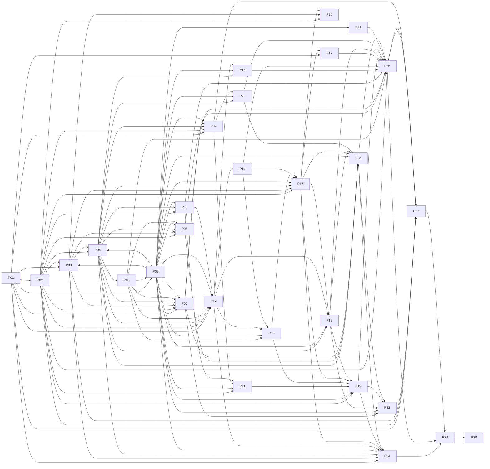

# SLICE-01 Dependency Map

Dependencies are defined per task in `tasks.md`. This document shows them at phase level, lists the decision gates and cross-phase
dependencies, and names the longest dependency chain. Everything here is derived from the task register.

## 1. Conceptual dependency chain (from the brief)

```
Foundation
  ↓
Database
  ↓
Authentication
  ↓
Tenant Context
  ↓
Authorization
  ↓
RBAC
  ↓
Restaurant
  ↓
Menu
  ↓
Orders
  ↓
KOT
  ↓
Kitchen
  ↓
Print Queue
  ↓
Print Agent

Orders → Transactions → Reports
Restaurant → Public Website
Menu → Social Menu
Design System → every UI task (built in parallel with backend foundations)
Security Hardening + Testing + Observability → Railway Deployment → Production Readiness → Final Release
```

## 2. Phase dependency graph (derived)



## 3. Phase dependency table

| Phase | Name | Depends on phases | Required by phases |
|---|---|---|---|
| P01 | Project Foundation | — | P02, P03, P07, P08, P09, P12, P17, P24, P27 |
| P02 | Database Foundation | P01 | P03, P04, P06, P07, P09, P10, P11, P12, P16, P19, P25, P26, P27 |
| P03 | Authentication | P01, P02, P08 | P04, P06, P07, P16, P24, P26, P27 |
| P04 | Multi-Tenant Authorization | P02, P03, P08 | P05, P06, P07, P09, P10, P12, P13, P16, P18, P20, P23, P24 |
| P05 | RBAC | P04 | P06, P07, P08, P12, P15, P25 |
| P06 | Super Admin | P02, P03, P04, P05, P08 | P23, P25 |
| P07 | Restaurant Management | P01, P02, P03, P04, P05, P08 | P09, P22, P23, P25 |
| P08 | Design System + Frontend Foundation | P01, P05 | P03, P04, P06, P07, P09, P10, P11, P12, P13, P15, P16, P18, P19, P20, P21, P22, P23, P24 |
| P09 | Public Restaurant Website | P01, P02, P04, P07, P08 | P11, P20, P27 |
| P10 | Menu Management | P02, P04, P08 | P11, P12, P25 |
| P11 | Daily Menu | P02, P08, P09, P10 | P19 |
| P12 | Orders | P01, P02, P04, P05, P08, P10 | P13, P14, P15, P18, P24 |
| P13 | Customers | P04, P08, P12 | P25 |
| P14 | KOT | P12 | P15, P16, P25 |
| P15 | Kitchen Management | P05, P08, P12, P14 | P16, P19 |
| P16 | Print Queue | P02, P03, P04, P08, P14, P15 | P17, P18, P19, P23, P24, P26 |
| P17 | Local Print Agent | P01, P16 | P25 |
| P18 | Transactions | P04, P08, P12, P16 | P19, P22, P23, P25 |
| P19 | Reports | P02, P08, P11, P15, P16, P18 | P22, P24, P25 |
| P20 | Social Menu + Sharing | P04, P08, P09 | P23, P25 |
| P21 | PWA | P08 | P25 |
| P22 | Timezone + Live Clock | P07, P08, P18, P19, P23 | — |
| P23 | Audit Logging | P04, P06, P07, P08, P16, P18, P20 | P22, P24, P25 |
| P24 | Security Hardening | P01, P03, P04, P08, P12, P16, P19, P23 | P28 |
| P25 | Testing + QA | P02, P05, P06, P07, P10, P13, P14, P17, P18, P19, P20, P21, P23, P27 | P27, P28 |
| P26 | Observability | P02, P03, P16 | — |
| P27 | Railway Deployment | P01, P02, P03, P09, P25 | P25, P28 |
| P28 | Production Readiness | P24, P25, P27 | P29 |
| P29 | Final Release | P28 | — |

## 4. Decision gates (Project Owner)

Each gate must be decided **before the first task it blocks starts**.

| Gate task | # | Decision | Must be decided before |
|---|---|---|---|
| S1-P01-T010 | 10 | Decision gate A: approve schema-affecting decisions | S1-P02-T002, S1-P07-T008, S1-P09-T001, S1-P12-T001, S1-P17-T001 |
| S1-P07-T008 | 51 | Decision: media storage for images | S1-P07-T009 |
| S1-P09-T001 | 78 | Decision gate: public hostname and public ordering | S1-P09-T002, S1-P09-T009, S1-P27-T001 |
| S1-P12-T001 | 101 | Decision gate: order rules | S1-P12-T004, S1-P12-T010 |
| S1-P17-T001 | 137 | Decision gate: agent runtime and printers | S1-P17-T002 |
| S1-P25-T012 | 197 | User acceptance testing with Project Owner | S1-P28-T001 |
| S1-P28-T006 | 221 | First tenant onboarding plan | S1-P28-T007 |
| S1-P28-T007 | 222 | Go / No-Go decision | S1-P29-T001 |
| S1-P29-T002 | 224 | First tenant go-live | S1-P29-T003 |

## 5. Cross-phase task dependencies

| Task | Depends on (other phases) |
|---|---|
| S1-P02-T001 | S1-P01-T008 |
| S1-P02-T002 | S1-P01-T010 |
| S1-P02-T008 | S1-P01-T006 |
| S1-P03-T001 | S1-P01-T004 |
| S1-P03-T003 | S1-P02-T005 |
| S1-P03-T007 | S1-P02-T005 |
| S1-P04-T001 | S1-P03-T003 |
| S1-P04-T009 | S1-P02-T008 |
| S1-P04-T010 | S1-P02-T005 |
| S1-P05-T001 | S1-P04-T001 |
| S1-P05-T002 | S1-P04-T009 |
| S1-P05-T006 | S1-P04-T001 |
| S1-P06-T001 | S1-P05-T001, S1-P03-T004, S1-P04-T010 |
| S1-P06-T008 | S1-P02-T007 |
| S1-P07-T002 | S1-P04-T006 |
| S1-P07-T001 | S1-P05-T001, S1-P04-T010, S1-P02-T011 |
| S1-P07-T004 | S1-P05-T003, S1-P03-T004 |
| S1-P07-T008 | S1-P01-T010 |
| S1-P08-T001 | S1-P01-T003 |
| S1-P03-T005 | S1-P08-T004 |
| S1-P08-T008 | S1-P05-T006 |
| S1-P06-T002 | S1-P04-T002, S1-P08-T008 |
| S1-P06-T004 | S1-P08-T007 |
| S1-P06-T005 | S1-P08-T005 |
| S1-P06-T007 | S1-P04-T010 |
| S1-P07-T005 | S1-P08-T005, S1-P08-T006, S1-P08-T008 |
| S1-P07-T006 | S1-P08-T006, S1-P08-T007, S1-P08-T008 |
| S1-P07-T007 | S1-P08-T005, S1-P08-T008 |
| S1-P03-T006 | S1-P08-T009 |
| S1-P04-T003 | S1-P08-T009 |
| S1-P08-T010 | S1-P01-T005 |
| S1-P08-T012 | S1-P01-T005 |
| S1-P09-T001 | S1-P01-T010 |
| S1-P09-T002 | S1-P02-T011, S1-P04-T005 |
| S1-P09-T003 | S1-P08-T004, S1-P08-T009 |
| S1-P09-T006 | S1-P07-T002 |
| S1-P09-T010 | S1-P08-T012 |
| S1-P10-T001 | S1-P04-T005, S1-P02-T010 |
| S1-P10-T002 | S1-P04-T010 |
| S1-P10-T005 | S1-P08-T006, S1-P08-T008 |
| S1-P10-T006 | S1-P08-T007, S1-P08-T008 |
| S1-P10-T007 | S1-P08-T005, S1-P08-T006 |
| S1-P10-T008 | S1-P04-T009 |
| S1-P11-T001 | S1-P10-T003, S1-P02-T011 |
| S1-P11-T003 | S1-P08-T006, S1-P08-T008 |
| S1-P11-T004 | S1-P09-T002 |
| S1-P12-T001 | S1-P01-T010 |
| S1-P12-T002 | S1-P02-T010 |
| S1-P12-T003 | S1-P02-T003, S1-P02-T011 |
| S1-P12-T004 | S1-P10-T004, S1-P04-T010 |
| S1-P12-T005 | S1-P05-T004 |
| S1-P12-T006 | S1-P05-T005 |
| S1-P12-T007 | S1-P08-T006, S1-P08-T008 |
| S1-P12-T008 | S1-P08-T009 |
| S1-P12-T011 | S1-P04-T009 |
| S1-P13-T001 | S1-P04-T005, S1-P04-T010 |
| S1-P13-T003 | S1-P08-T007, S1-P08-T008 |
| S1-P13-T004 | S1-P12-T007 |
| S1-P14-T001 | S1-P12-T005, S1-P12-T003 |
| S1-P14-T005 | S1-P12-T009 |
| S1-P15-T001 | S1-P14-T004, S1-P05-T005 |
| S1-P15-T002 | S1-P08-T009, S1-P08-T008 |
| S1-P15-T003 | S1-P12-T005 |
| S1-P16-T001 | S1-P02-T003, S1-P04-T008 |
| S1-P16-T002 | S1-P14-T001 |
| S1-P16-T004 | S1-P03-T007 |
| S1-P16-T005 | S1-P03-T007 |
| S1-P16-T006 | S1-P08-T007, S1-P08-T008 |
| S1-P16-T009 | S1-P15-T002 |
| S1-P17-T001 | S1-P01-T010 |
| S1-P17-T002 | S1-P16-T002 |
| S1-P17-T003 | S1-P16-T005 |
| S1-P17-T008 | S1-P16-T003 |
| S1-P18-T001 | S1-P12-T005, S1-P04-T010 |
| S1-P18-T005 | S1-P08-T007, S1-P08-T008 |
| S1-P18-T006 | S1-P12-T009 |
| S1-P18-T007 | S1-P08-T005 |
| S1-P18-T008 | S1-P16-T003 |
| S1-P19-T001 | S1-P18-T003, S1-P02-T011 |
| S1-P19-T002 | S1-P16-T005, S1-P11-T001 |
| S1-P19-T003 | S1-P08-T007, S1-P08-T008 |
| S1-P19-T004 | S1-P08-T008 |
| S1-P19-T006 | S1-P18-T005, S1-P15-T002 |
| S1-P20-T001 | S1-P09-T006 |
| S1-P20-T002 | S1-P04-T010 |
| S1-P20-T003 | S1-P08-T006, S1-P08-T008 |
| S1-P21-T001 | S1-P08-T003 |
| S1-P22-T001 | S1-P08-T008 |
| S1-P22-T003 | S1-P07-T001 |
| S1-P23-T001 | S1-P20-T002, S1-P18-T003, S1-P16-T005, S1-P07-T004, S1-P06-T001 |
| S1-P23-T002 | S1-P08-T007, S1-P08-T008 |
| S1-P22-T002 | S1-P19-T003, S1-P18-T005, S1-P23-T002 |
| S1-P22-T004 | S1-P19-T001 |
| S1-P23-T003 | S1-P04-T010 |
| S1-P24-T001 | S1-P08-T002 |
| S1-P24-T002 | S1-P04-T002 |
| S1-P24-T003 | S1-P03-T007, S1-P16-T005 |
| S1-P24-T004 | S1-P16-T002 |
| S1-P24-T005 | S1-P12-T006 |
| S1-P24-T006 | S1-P01-T006 |
| S1-P24-T007 | S1-P19-T002 |
| S1-P24-T008 | S1-P16-T008, S1-P23-T001 |
| S1-P25-T001 | S1-P23-T001, S1-P20-T004, S1-P18-T009, S1-P13-T005, S1-P14-T006, S1-P10-T008 |
| S1-P25-T002 | S1-P05-T002, S1-P23-T001 |
| S1-P25-T003 | S1-P19-T004, S1-P20-T003, S1-P17-T008, S1-P21-T003, S1-P07-T006, S1-P06-T006 |
| S1-P25-T008 | S1-P02-T009 |
| S1-P25-T009 | S1-P17-T009 |
| S1-P26-T001 | S1-P03-T002 |
| S1-P26-T003 | S1-P02-T005 |
| S1-P26-T005 | S1-P03-T007 |
| S1-P26-T007 | S1-P16-T005 |
| S1-P27-T001 | S1-P01-T008, S1-P09-T001 |
| S1-P27-T003 | S1-P02-T009 |
| S1-P25-T007 | S1-P27-T003 |
| S1-P27-T005 | S1-P03-T008 |
| S1-P27-T008 | S1-P25-T003 |
| S1-P28-T001 | S1-P25-T012, S1-P24-T009, S1-P27-T008 |
| S1-P28-T002 | S1-P25-T007 |
| S1-P28-T003 | S1-P24-T009, S1-P27-T004 |
| S1-P28-T005 | S1-P27-T009 |
| S1-P28-T006 | S1-P27-T005 |
| S1-P29-T001 | S1-P28-T007 |

## 6. Longest dependency chain (35 tasks)

A delay anywhere on this chain delays final acceptance.

1. S1-P01-T001 — Verify and record the baseline scaffold
1. S1-P01-T002 — Align npm scripts with CLAUDE.md commands
1. S1-P01-T004 — Validate environment configuration at startup
1. S1-P01-T008 — Provision Railway staging environment
1. S1-P02-T001 — Confirm PostgreSQL version and capabilities
1. S1-P02-T002 — Author Prisma schema v2
1. S1-P02-T003 — Create migration baseline 0001_init with raw SQL constraints
1. S1-P02-T005 — Database client, data-access skeleton and statement timeout
1. S1-P03-T003 — Session resolver and invited-user linking
1. S1-P04-T001 — Tenant and platform context resolution
1. S1-P04-T002 — Authorization guards and guard coverage check
1. S1-P04-T005 — Error model and not-found parity
1. S1-P10-T001 — Menu data layer
1. S1-P10-T002 — Category services and actions
1. S1-P10-T003 — Menu item services and actions
1. S1-P10-T004 — Variants and add-ons
1. S1-P12-T004 — Order creation service
1. S1-P12-T005 — Order state machine service
1. S1-P18-T001 — Payment ledger service
1. S1-P18-T002 — Refunds and voids
1. S1-P18-T003 — Business day close
1. S1-P19-T001 — Report aggregation data layer
1. S1-P19-T002 — Dashboard summary loader and polling route
1. S1-P19-T004 — Dashboard UI
1. S1-P25-T003 — End-to-end journeys
1. S1-P25-T010 — Visual QA pass
1. S1-P25-T012 — User acceptance testing with Project Owner
1. S1-P28-T001 — Release gate evidence review
1. S1-P28-T004 — Knowledge Base synchronisation and consistency scan
1. S1-P28-T007 — Go / No-Go decision
1. S1-P29-T001 — Production deployment
1. S1-P29-T002 — First tenant go-live
1. S1-P29-T003 — Hypercare
1. S1-P29-T004 — Post-release Knowledge Base update
1. S1-P29-T005 — Project Owner final acceptance

## 7. Full task dependency list

| # | Task | Dependencies | Dependents |
|---|---|---|---|
| 1 | S1-P01-T001 | none | S1-P01-T002, S1-P01-T007 |
| 2 | S1-P01-T002 | S1-P01-T001 | S1-P01-T003, S1-P01-T004, S1-P01-T005, S1-P01-T009 |
| 3 | S1-P01-T003 | S1-P01-T002 | S1-P01-T006, S1-P08-T001 |
| 4 | S1-P01-T004 | S1-P01-T002 | S1-P01-T008, S1-P01-T009, S1-P03-T001 |
| 5 | S1-P01-T005 | S1-P01-T002 | S1-P01-T006, S1-P08-T010, S1-P08-T012 |
| 6 | S1-P01-T006 | S1-P01-T003, S1-P01-T005 | S1-P02-T008, S1-P24-T006 |
| 7 | S1-P01-T007 | S1-P01-T001 | — |
| 8 | S1-P01-T008 | S1-P01-T004 | S1-P02-T001, S1-P27-T001 |
| 9 | S1-P01-T009 | S1-P01-T002, S1-P01-T004 | — |
| 10 | S1-P01-T010 | none | S1-P02-T002, S1-P07-T008, S1-P09-T001, S1-P12-T001, S1-P17-T001 |
| 11 | S1-P02-T001 | S1-P01-T008 | S1-P02-T002 |
| 12 | S1-P02-T002 | S1-P01-T010, S1-P02-T001 | S1-P02-T003 |
| 13 | S1-P02-T003 | S1-P02-T002 | S1-P02-T004, S1-P02-T005, S1-P02-T007, S1-P02-T008, S1-P02-T009, S1-P12-T003, S1-P16-T001 |
| 14 | S1-P02-T004 | S1-P02-T003 | — |
| 15 | S1-P02-T005 | S1-P02-T003 | S1-P02-T006, S1-P02-T010, S1-P02-T011, S1-P03-T003, S1-P03-T007, S1-P04-T010, S1-P26-T003 |
| 16 | S1-P02-T006 | S1-P02-T005 | — |
| 17 | S1-P02-T007 | S1-P02-T003 | S1-P06-T008 |
| 18 | S1-P02-T008 | S1-P02-T003, S1-P01-T006 | S1-P04-T009 |
| 19 | S1-P02-T009 | S1-P02-T003 | S1-P25-T008, S1-P27-T003 |
| 20 | S1-P02-T010 | S1-P02-T005 | S1-P10-T001, S1-P12-T002 |
| 21 | S1-P02-T011 | S1-P02-T005 | S1-P07-T001, S1-P09-T002, S1-P11-T001, S1-P12-T003, S1-P19-T001 |
| 22 | S1-P03-T001 | S1-P01-T004 | S1-P03-T002, S1-P03-T005 |
| 23 | S1-P03-T002 | S1-P03-T001 | S1-P03-T003, S1-P26-T001 |
| 24 | S1-P03-T003 | S1-P03-T002, S1-P02-T005 | S1-P03-T004, S1-P03-T006, S1-P03-T008, S1-P03-T009, S1-P04-T001 |
| 25 | S1-P03-T004 | S1-P03-T003 | S1-P06-T001, S1-P07-T004 |
| 26 | S1-P03-T007 | S1-P02-T005 | S1-P03-T008, S1-P16-T004, S1-P16-T005, S1-P24-T003, S1-P26-T005 |
| 27 | S1-P03-T008 | S1-P03-T003, S1-P03-T007 | S1-P27-T005 |
| 28 | S1-P03-T009 | S1-P03-T003 | — |
| 29 | S1-P04-T001 | S1-P03-T003 | S1-P04-T002, S1-P04-T003, S1-P04-T004, S1-P05-T001, S1-P05-T006 |
| 30 | S1-P04-T002 | S1-P04-T001 | S1-P04-T005, S1-P04-T007, S1-P04-T008, S1-P06-T002, S1-P24-T002 |
| 31 | S1-P04-T004 | S1-P04-T001 | — |
| 32 | S1-P04-T005 | S1-P04-T002 | S1-P04-T006, S1-P04-T008, S1-P09-T002, S1-P10-T001, S1-P13-T001 |
| 33 | S1-P04-T006 | S1-P04-T005 | S1-P04-T007, S1-P07-T002 |
| 34 | S1-P04-T007 | S1-P04-T002, S1-P04-T006 | S1-P04-T009 |
| 35 | S1-P04-T008 | S1-P04-T002, S1-P04-T005 | S1-P16-T001 |
| 36 | S1-P04-T009 | S1-P02-T008, S1-P04-T007 | S1-P05-T002, S1-P10-T008, S1-P12-T011 |
| 37 | S1-P04-T010 | S1-P02-T005 | S1-P06-T001, S1-P06-T007, S1-P07-T001, S1-P10-T002, S1-P12-T004, S1-P13-T001, S1-P18-T001, S1-P20-T002, S1-P23-T003 |
| 38 | S1-P05-T001 | S1-P04-T001 | S1-P05-T002, S1-P05-T003, S1-P05-T004, S1-P05-T005, S1-P05-T006, S1-P06-T001, S1-P07-T001 |
| 39 | S1-P05-T002 | S1-P05-T001, S1-P04-T009 | S1-P05-T007, S1-P25-T002 |
| 40 | S1-P05-T003 | S1-P05-T001 | S1-P05-T007, S1-P07-T004 |
| 41 | S1-P05-T004 | S1-P05-T001 | S1-P12-T005 |
| 42 | S1-P05-T005 | S1-P05-T001 | S1-P05-T007, S1-P12-T006, S1-P15-T001 |
| 43 | S1-P05-T006 | S1-P05-T001, S1-P04-T001 | S1-P08-T008 |
| 44 | S1-P05-T007 | S1-P05-T002, S1-P05-T003, S1-P05-T005 | — |
| 45 | S1-P06-T001 | S1-P05-T001, S1-P03-T004, S1-P04-T010 | S1-P06-T003, S1-P23-T001 |
| 46 | S1-P06-T008 | S1-P02-T007 | — |
| 47 | S1-P07-T002 | S1-P04-T006 | S1-P07-T001, S1-P07-T007, S1-P07-T009, S1-P09-T006 |
| 48 | S1-P07-T001 | S1-P05-T001, S1-P04-T010, S1-P02-T011, S1-P07-T002 | S1-P07-T003, S1-P07-T005, S1-P07-T007, S1-P22-T003 |
| 49 | S1-P07-T003 | S1-P07-T001 | S1-P07-T005 |
| 50 | S1-P07-T004 | S1-P05-T003, S1-P03-T004 | S1-P07-T006, S1-P23-T001 |
| 51 | S1-P07-T008 | S1-P01-T010 | S1-P07-T009 |
| 52 | S1-P07-T009 | S1-P07-T008, S1-P07-T002 | — |
| 53 | S1-P08-T001 | S1-P01-T003 | S1-P08-T002, S1-P08-T003, S1-P08-T011 |
| 54 | S1-P08-T002 | S1-P08-T001 | S1-P08-T004, S1-P24-T001 |
| 55 | S1-P08-T003 | S1-P08-T001 | S1-P08-T004, S1-P21-T001 |
| 56 | S1-P08-T004 | S1-P08-T002, S1-P08-T003 | S1-P03-T005, S1-P08-T005, S1-P08-T006, S1-P08-T007, S1-P08-T009, S1-P08-T013, S1-P09-T003 |
| 57 | S1-P03-T005 | S1-P03-T001, S1-P08-T004 | — |
| 58 | S1-P08-T005 | S1-P08-T004 | S1-P06-T005, S1-P07-T005, S1-P07-T007, S1-P10-T007, S1-P18-T007 |
| 59 | S1-P08-T006 | S1-P08-T004 | S1-P07-T005, S1-P07-T006, S1-P08-T008, S1-P08-T010, S1-P10-T005, S1-P10-T007, S1-P11-T003, S1-P12-T007, S1-P20-T003 |
| 60 | S1-P08-T007 | S1-P08-T004 | S1-P06-T004, S1-P07-T006, S1-P10-T006, S1-P13-T003, S1-P16-T006, S1-P18-T005, S1-P19-T003, S1-P23-T002 |
| 61 | S1-P08-T008 | S1-P08-T006, S1-P05-T006 | S1-P06-T002, S1-P07-T005, S1-P07-T006, S1-P07-T007, S1-P08-T012, S1-P10-T005, S1-P10-T006, S1-P11-T003, S1-P12-T007, S1-P13-T003, S1-P15-T002, S1-P16-T006, S1-P18-T005, S1-P19-T003, S1-P19-T004, S1-P20-T003, S1-P22-T001, S1-P23-T002 |
| 62 | S1-P06-T002 | S1-P04-T002, S1-P08-T008 | S1-P06-T003 |
| 63 | S1-P06-T003 | S1-P06-T001, S1-P06-T002 | S1-P06-T004 |
| 64 | S1-P06-T004 | S1-P06-T003, S1-P08-T007 | S1-P06-T005 |
| 65 | S1-P06-T005 | S1-P06-T004, S1-P08-T005 | S1-P06-T006 |
| 66 | S1-P06-T006 | S1-P06-T005 | S1-P06-T007, S1-P25-T003 |
| 67 | S1-P06-T007 | S1-P06-T006, S1-P04-T010 | — |
| 68 | S1-P07-T005 | S1-P07-T001, S1-P07-T003, S1-P08-T005, S1-P08-T006, S1-P08-T008 | — |
| 69 | S1-P07-T006 | S1-P07-T004, S1-P08-T006, S1-P08-T007, S1-P08-T008 | S1-P25-T003 |
| 70 | S1-P07-T007 | S1-P07-T001, S1-P07-T002, S1-P08-T005, S1-P08-T008 | — |
| 71 | S1-P08-T009 | S1-P08-T004 | S1-P03-T006, S1-P04-T003, S1-P09-T003, S1-P12-T008, S1-P15-T002 |
| 72 | S1-P03-T006 | S1-P03-T003, S1-P08-T009 | — |
| 73 | S1-P04-T003 | S1-P04-T001, S1-P08-T009 | — |
| 74 | S1-P08-T010 | S1-P08-T006, S1-P01-T005 | — |
| 75 | S1-P08-T011 | S1-P08-T001 | — |
| 76 | S1-P08-T012 | S1-P08-T008, S1-P01-T005 | S1-P09-T010 |
| 77 | S1-P08-T013 | S1-P08-T004 | — |
| 78 | S1-P09-T001 | S1-P01-T010 | S1-P09-T002, S1-P09-T009, S1-P27-T001 |
| 79 | S1-P09-T002 | S1-P02-T011, S1-P04-T005, S1-P09-T001 | S1-P09-T003, S1-P09-T006, S1-P09-T007, S1-P11-T004 |
| 80 | S1-P09-T003 | S1-P09-T002, S1-P08-T004, S1-P08-T009 | S1-P09-T004, S1-P09-T005, S1-P09-T008, S1-P09-T010 |
| 81 | S1-P09-T004 | S1-P09-T003 | — |
| 82 | S1-P09-T005 | S1-P09-T003 | S1-P09-T010 |
| 83 | S1-P09-T006 | S1-P09-T002, S1-P07-T002 | S1-P09-T008, S1-P20-T001 |
| 84 | S1-P09-T007 | S1-P09-T002 | — |
| 85 | S1-P09-T008 | S1-P09-T003, S1-P09-T006 | — |
| 86 | S1-P09-T009 | S1-P09-T001 | — |
| 87 | S1-P09-T010 | S1-P09-T003, S1-P09-T005, S1-P08-T012 | — |
| 88 | S1-P10-T001 | S1-P04-T005, S1-P02-T010 | S1-P10-T002 |
| 89 | S1-P10-T002 | S1-P10-T001, S1-P04-T010 | S1-P10-T003, S1-P10-T005 |
| 90 | S1-P10-T003 | S1-P10-T002 | S1-P10-T004, S1-P10-T006, S1-P11-T001 |
| 91 | S1-P10-T004 | S1-P10-T003 | S1-P10-T007, S1-P10-T008, S1-P12-T004 |
| 92 | S1-P10-T005 | S1-P10-T002, S1-P08-T006, S1-P08-T008 | — |
| 93 | S1-P10-T006 | S1-P10-T003, S1-P08-T007, S1-P08-T008 | — |
| 94 | S1-P10-T007 | S1-P10-T004, S1-P08-T005, S1-P08-T006 | — |
| 95 | S1-P10-T008 | S1-P10-T004, S1-P04-T009 | S1-P25-T001 |
| 96 | S1-P11-T001 | S1-P10-T003, S1-P02-T011 | S1-P11-T002, S1-P11-T004, S1-P11-T005, S1-P19-T002 |
| 97 | S1-P11-T002 | S1-P11-T001 | S1-P11-T003 |
| 98 | S1-P11-T003 | S1-P11-T002, S1-P08-T006, S1-P08-T008 | — |
| 99 | S1-P11-T004 | S1-P11-T001, S1-P09-T002 | — |
| 100 | S1-P11-T005 | S1-P11-T001 | — |
| 101 | S1-P12-T001 | S1-P01-T010 | S1-P12-T004, S1-P12-T010 |
| 102 | S1-P12-T002 | S1-P02-T010 | S1-P12-T004 |
| 103 | S1-P12-T003 | S1-P02-T003, S1-P02-T011 | S1-P12-T004, S1-P14-T001 |
| 104 | S1-P12-T004 | S1-P12-T001, S1-P12-T002, S1-P12-T003, S1-P10-T004, S1-P04-T010 | S1-P12-T005 |
| 105 | S1-P12-T005 | S1-P12-T004, S1-P05-T004 | S1-P12-T006, S1-P12-T010, S1-P14-T001, S1-P15-T003, S1-P18-T001 |
| 106 | S1-P12-T006 | S1-P12-T005, S1-P05-T005 | S1-P12-T007, S1-P12-T008, S1-P12-T011, S1-P24-T005 |
| 107 | S1-P12-T007 | S1-P12-T006, S1-P08-T006, S1-P08-T008 | S1-P13-T004 |
| 108 | S1-P12-T008 | S1-P12-T006, S1-P08-T009 | S1-P12-T009 |
| 109 | S1-P12-T009 | S1-P12-T008 | S1-P14-T005, S1-P18-T006 |
| 110 | S1-P12-T010 | S1-P12-T005, S1-P12-T001 | — |
| 111 | S1-P12-T011 | S1-P12-T006, S1-P04-T009 | — |
| 112 | S1-P13-T001 | S1-P04-T005, S1-P04-T010 | S1-P13-T002 |
| 113 | S1-P13-T002 | S1-P13-T001 | S1-P13-T003, S1-P13-T004, S1-P13-T005 |
| 114 | S1-P13-T003 | S1-P13-T002, S1-P08-T007, S1-P08-T008 | — |
| 115 | S1-P13-T004 | S1-P13-T002, S1-P12-T007 | — |
| 116 | S1-P13-T005 | S1-P13-T002 | S1-P25-T001 |
| 117 | S1-P14-T001 | S1-P12-T005, S1-P12-T003 | S1-P14-T002, S1-P14-T004, S1-P16-T002 |
| 118 | S1-P14-T002 | S1-P14-T001 | S1-P14-T003, S1-P14-T005, S1-P14-T006 |
| 119 | S1-P14-T003 | S1-P14-T002 | — |
| 120 | S1-P14-T004 | S1-P14-T001 | S1-P15-T001 |
| 121 | S1-P14-T005 | S1-P14-T002, S1-P12-T009 | — |
| 122 | S1-P14-T006 | S1-P14-T002 | S1-P25-T001 |
| 123 | S1-P15-T001 | S1-P14-T004, S1-P05-T005 | S1-P15-T002, S1-P15-T005 |
| 124 | S1-P15-T002 | S1-P15-T001, S1-P08-T009, S1-P08-T008 | S1-P15-T004, S1-P16-T009, S1-P19-T006 |
| 125 | S1-P15-T003 | S1-P12-T005 | — |
| 126 | S1-P15-T004 | S1-P15-T002 | — |
| 127 | S1-P15-T005 | S1-P15-T001 | — |
| 128 | S1-P16-T001 | S1-P02-T003, S1-P04-T008 | S1-P16-T003, S1-P16-T004, S1-P16-T007 |
| 129 | S1-P16-T002 | S1-P14-T001 | S1-P16-T003, S1-P17-T002, S1-P24-T004 |
| 130 | S1-P16-T003 | S1-P16-T001, S1-P16-T002 | S1-P17-T008, S1-P18-T008 |
| 131 | S1-P16-T004 | S1-P16-T001, S1-P03-T007 | S1-P16-T005 |
| 132 | S1-P16-T005 | S1-P16-T004, S1-P03-T007 | S1-P16-T006, S1-P16-T008, S1-P17-T003, S1-P19-T002, S1-P23-T001, S1-P24-T003, S1-P26-T007 |
| 133 | S1-P16-T006 | S1-P16-T005, S1-P08-T007, S1-P08-T008 | S1-P16-T009 |
| 134 | S1-P16-T007 | S1-P16-T001 | — |
| 135 | S1-P16-T008 | S1-P16-T005 | S1-P24-T008 |
| 136 | S1-P16-T009 | S1-P16-T006, S1-P15-T002 | — |
| 137 | S1-P17-T001 | S1-P01-T010 | S1-P17-T002 |
| 138 | S1-P17-T002 | S1-P17-T001, S1-P16-T002 | S1-P17-T003, S1-P17-T005, S1-P17-T007 |
| 139 | S1-P17-T003 | S1-P17-T002, S1-P16-T005 | S1-P17-T004 |
| 140 | S1-P17-T004 | S1-P17-T003 | S1-P17-T008 |
| 141 | S1-P17-T005 | S1-P17-T002 | S1-P17-T006 |
| 142 | S1-P17-T006 | S1-P17-T005 | S1-P17-T008, S1-P17-T009 |
| 143 | S1-P17-T007 | S1-P17-T002 | S1-P17-T008 |
| 144 | S1-P17-T008 | S1-P17-T004, S1-P17-T006, S1-P17-T007, S1-P16-T003 | S1-P25-T003 |
| 145 | S1-P17-T009 | S1-P17-T006 | S1-P17-T010, S1-P25-T009 |
| 146 | S1-P17-T010 | S1-P17-T009 | — |
| 147 | S1-P18-T001 | S1-P12-T005, S1-P04-T010 | S1-P18-T002, S1-P18-T008 |
| 148 | S1-P18-T002 | S1-P18-T001 | S1-P18-T003, S1-P18-T004, S1-P18-T006 |
| 149 | S1-P18-T003 | S1-P18-T002 | S1-P18-T007, S1-P18-T009, S1-P19-T001, S1-P23-T001 |
| 150 | S1-P18-T004 | S1-P18-T002 | S1-P18-T005 |
| 151 | S1-P18-T005 | S1-P18-T004, S1-P08-T007, S1-P08-T008 | S1-P19-T006, S1-P22-T002 |
| 152 | S1-P18-T006 | S1-P18-T002, S1-P12-T009 | — |
| 153 | S1-P18-T007 | S1-P18-T003, S1-P08-T005 | — |
| 154 | S1-P18-T008 | S1-P18-T001, S1-P16-T003 | — |
| 155 | S1-P18-T009 | S1-P18-T003 | S1-P25-T001 |
| 156 | S1-P19-T001 | S1-P18-T003, S1-P02-T011 | S1-P19-T002, S1-P19-T003, S1-P19-T005, S1-P22-T004 |
| 157 | S1-P19-T002 | S1-P19-T001, S1-P16-T005, S1-P11-T001 | S1-P19-T004, S1-P24-T007 |
| 158 | S1-P19-T003 | S1-P19-T001, S1-P08-T007, S1-P08-T008 | S1-P19-T006, S1-P22-T002 |
| 159 | S1-P19-T004 | S1-P19-T002, S1-P08-T008 | S1-P25-T003 |
| 160 | S1-P19-T005 | S1-P19-T001 | — |
| 161 | S1-P19-T006 | S1-P19-T003, S1-P18-T005, S1-P15-T002 | — |
| 162 | S1-P20-T001 | S1-P09-T006 | S1-P20-T002 |
| 163 | S1-P20-T002 | S1-P20-T001, S1-P04-T010 | S1-P20-T003, S1-P20-T004, S1-P23-T001 |
| 164 | S1-P20-T003 | S1-P20-T002, S1-P08-T006, S1-P08-T008 | S1-P25-T003 |
| 165 | S1-P20-T004 | S1-P20-T002 | S1-P25-T001 |
| 166 | S1-P21-T001 | S1-P08-T003 | S1-P21-T002 |
| 167 | S1-P21-T002 | S1-P21-T001 | S1-P21-T003 |
| 168 | S1-P21-T003 | S1-P21-T002 | S1-P21-T004, S1-P25-T003 |
| 169 | S1-P21-T004 | S1-P21-T003 | — |
| 170 | S1-P22-T001 | S1-P08-T008 | — |
| 171 | S1-P22-T003 | S1-P07-T001 | — |
| 172 | S1-P23-T001 | S1-P20-T002, S1-P18-T003, S1-P16-T005, S1-P07-T004, S1-P06-T001 | S1-P23-T002, S1-P23-T004, S1-P24-T008, S1-P25-T001, S1-P25-T002 |
| 173 | S1-P23-T002 | S1-P23-T001, S1-P08-T007, S1-P08-T008 | S1-P22-T002 |
| 174 | S1-P22-T002 | S1-P19-T003, S1-P18-T005, S1-P23-T002 | S1-P22-T004 |
| 175 | S1-P22-T004 | S1-P22-T002, S1-P19-T001 | — |
| 176 | S1-P23-T003 | S1-P04-T010 | — |
| 177 | S1-P23-T004 | S1-P23-T001 | — |
| 178 | S1-P24-T001 | S1-P08-T002 | S1-P24-T009 |
| 179 | S1-P24-T002 | S1-P04-T002 | S1-P24-T008 |
| 180 | S1-P24-T003 | S1-P03-T007, S1-P16-T005 | S1-P24-T008 |
| 181 | S1-P24-T004 | S1-P16-T002 | S1-P24-T009 |
| 182 | S1-P24-T005 | S1-P12-T006 | S1-P24-T009 |
| 183 | S1-P24-T006 | S1-P01-T006 | S1-P24-T009 |
| 184 | S1-P24-T007 | S1-P19-T002 | S1-P24-T009 |
| 185 | S1-P24-T008 | S1-P24-T002, S1-P24-T003, S1-P16-T008, S1-P23-T001 | S1-P24-T009 |
| 186 | S1-P24-T009 | S1-P24-T001, S1-P24-T004, S1-P24-T005, S1-P24-T006, S1-P24-T007, S1-P24-T008 | S1-P28-T001, S1-P28-T003 |
| 187 | S1-P25-T001 | S1-P23-T001, S1-P20-T004, S1-P18-T009, S1-P13-T005, S1-P14-T006, S1-P10-T008 | — |
| 188 | S1-P25-T002 | S1-P05-T002, S1-P23-T001 | — |
| 189 | S1-P25-T003 | S1-P19-T004, S1-P20-T003, S1-P17-T008, S1-P21-T003, S1-P07-T006, S1-P06-T006 | S1-P25-T004, S1-P25-T005, S1-P25-T006, S1-P25-T007, S1-P25-T010, S1-P25-T012, S1-P27-T008 |
| 190 | S1-P25-T004 | S1-P25-T003 | — |
| 191 | S1-P25-T005 | S1-P25-T003 | — |
| 192 | S1-P25-T006 | S1-P25-T003 | — |
| 193 | S1-P25-T008 | S1-P02-T009 | — |
| 194 | S1-P25-T009 | S1-P17-T009 | — |
| 195 | S1-P25-T010 | S1-P25-T003 | S1-P25-T011, S1-P25-T012 |
| 196 | S1-P25-T011 | S1-P25-T010 | — |
| 197 | S1-P25-T012 | S1-P25-T003, S1-P25-T010 | S1-P28-T001 |
| 198 | S1-P26-T001 | S1-P03-T002 | S1-P26-T002, S1-P26-T004, S1-P26-T006, S1-P26-T007, S1-P26-T008 |
| 199 | S1-P26-T002 | S1-P26-T001 | — |
| 200 | S1-P26-T003 | S1-P02-T005 | — |
| 201 | S1-P26-T004 | S1-P26-T001 | — |
| 202 | S1-P26-T005 | S1-P03-T007 | — |
| 203 | S1-P26-T006 | S1-P26-T001 | — |
| 204 | S1-P26-T007 | S1-P16-T005, S1-P26-T001 | — |
| 205 | S1-P26-T008 | S1-P26-T001 | — |
| 206 | S1-P27-T001 | S1-P01-T008, S1-P09-T001 | S1-P27-T002, S1-P27-T003, S1-P27-T004, S1-P27-T005 |
| 207 | S1-P27-T002 | S1-P27-T001 | S1-P27-T006 |
| 208 | S1-P27-T003 | S1-P27-T001, S1-P02-T009 | S1-P25-T007, S1-P27-T007, S1-P27-T008 |
| 209 | S1-P25-T007 | S1-P25-T003, S1-P27-T003 | S1-P28-T002 |
| 210 | S1-P27-T004 | S1-P27-T001 | S1-P28-T003 |
| 211 | S1-P27-T005 | S1-P27-T001, S1-P03-T008 | S1-P28-T006 |
| 212 | S1-P27-T006 | S1-P27-T002 | — |
| 213 | S1-P27-T007 | S1-P27-T003 | S1-P27-T009 |
| 214 | S1-P27-T008 | S1-P27-T003, S1-P25-T003 | S1-P28-T001 |
| 215 | S1-P27-T009 | S1-P27-T007 | S1-P28-T005 |
| 216 | S1-P28-T001 | S1-P25-T012, S1-P24-T009, S1-P27-T008 | S1-P28-T004, S1-P28-T007 |
| 217 | S1-P28-T002 | S1-P25-T007 | S1-P28-T007 |
| 218 | S1-P28-T003 | S1-P24-T009, S1-P27-T004 | S1-P28-T007 |
| 219 | S1-P28-T004 | S1-P28-T001 | S1-P28-T007 |
| 220 | S1-P28-T005 | S1-P27-T009 | S1-P28-T007 |
| 221 | S1-P28-T006 | S1-P27-T005 | S1-P28-T007 |
| 222 | S1-P28-T007 | S1-P28-T001, S1-P28-T002, S1-P28-T003, S1-P28-T004, S1-P28-T005, S1-P28-T006 | S1-P29-T001 |
| 223 | S1-P29-T001 | S1-P28-T007 | S1-P29-T002 |
| 224 | S1-P29-T002 | S1-P29-T001 | S1-P29-T003 |
| 225 | S1-P29-T003 | S1-P29-T002 | S1-P29-T004 |
| 226 | S1-P29-T004 | S1-P29-T003 | S1-P29-T005 |
| 227 | S1-P29-T005 | S1-P29-T004 | — |
