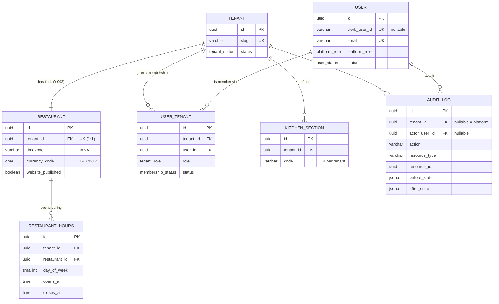
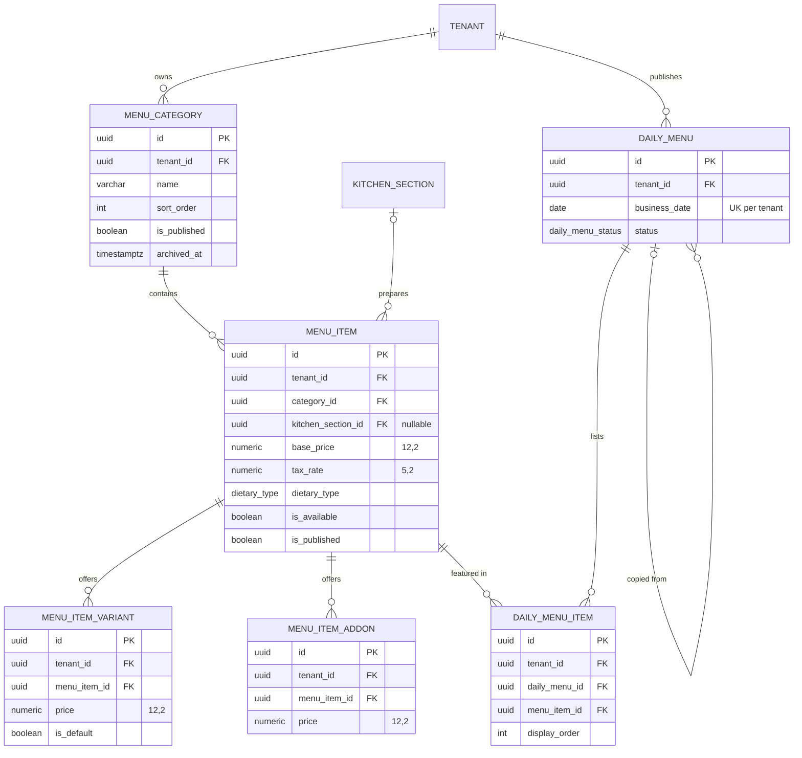
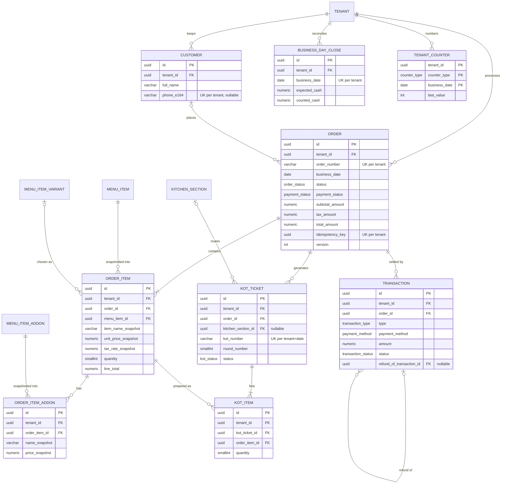
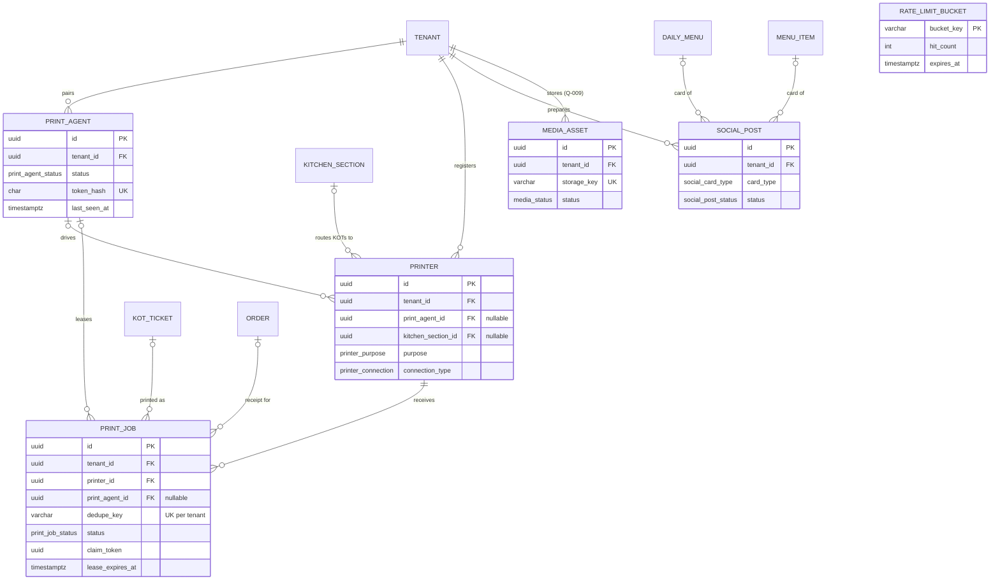

# SLICE-01 Entity Relationship Diagram

This document shows **how entities relate**: keys, cardinality, tenant ownership path, deletion behaviour and audit.
Exact fields, types, nullability, defaults and validation are in `data-model.md`. Diagram field lists show
key and representative columns only.

## 1. Entity inventory

| # | Entity | Table | Baseline? | Why it exists |
|---|---|---|---|---|
| E01 | TENANT | `tenants` | yes | Root of isolation (brief §5) |
| E02 | RESTAURANT | `restaurants` | yes | Identity, branding, timezone, website settings (brief §19–20) |
| E03 | RESTAURANT_HOURS | `restaurant_hours` | new | Structured opening hours (brief §19, §35) |
| E04 | KITCHEN_SECTION | `kitchen_sections` | new | KOT sections and printer routing (brief §28–30) |
| E05 | USER | `users` | yes | Identity mapped to Clerk (brief §16) |
| E06 | USER_TENANT | `user_tenants` | yes | Authorization membership + role (brief §4, §17) |
| E07 | MENU_CATEGORY | `menu_categories` | yes | brief §24 |
| E08 | MENU_ITEM | `menu_items` | yes | brief §24 |
| E09 | MENU_ITEM_VARIANT | `menu_item_variants` | new | Variants with NUMERIC prices (brief §24; CLAUDE.md rule 4; ADR-010) |
| E10 | MENU_ITEM_ADDON | `menu_item_addons` | new | Add-ons with NUMERIC prices (same) |
| E11 | DAILY_MENU | `daily_menus` | yes | brief §25 |
| E12 | DAILY_MENU_ITEM | `daily_menu_items` | yes | brief §25 |
| E13 | CUSTOMER | `customers` | yes | brief §27 |
| E14 | ORDER | `orders` | yes | brief §26 |
| E15 | ORDER_ITEM | `order_items` | yes | Snapshots (CLAUDE.md rule 4) |
| E16 | ORDER_ITEM_ADDON | `order_item_addons` | new | Add-on price snapshots |
| E17 | KOT_TICKET | `kot_tickets` | yes | brief §28 |
| E18 | KOT_ITEM | `kot_items` | new | KOT items/quantities/instructions per section (brief §28) |
| E19 | TRANSACTION | `transactions` | yes | brief §31 |
| E20 | BUSINESS_DAY_CLOSE | `business_day_closes` | new | Reconciliation (brief §31) |
| E21 | PRINTER | `printers` | new | Printer registration/configuration (brief §30) |
| E22 | PRINT_AGENT | `print_agents` | new | Agent authentication (brief §30; ADR-007) |
| E23 | PRINT_JOB | `print_jobs` | yes | brief §30 |
| E24 | AUDIT_LOG | `audit_logs` | yes | brief §36 |
| E25 | SOCIAL_POST | `social_posts` | yes | brief §33 |
| E26 | TENANT_COUNTER | `tenant_counters` | new | Race-free sequential numbering (ADR-010 §6) |
| E27 | RATE_LIMIT_BUCKET | `rate_limit_buckets` | new | Rate limiting (brief §38; ADR-011) |
| E28 | MEDIA_ASSET | `media_assets` | new, **gated Q-009** | File uploads (brief §38) |

27 entities are unconditional. E28 is created only if Q-009 approves uploads.

## 2. Diagram — tenancy, identity and restaurant

## 3. Diagram — menu and daily menu

## 4. Diagram — orders, kitchen, money

## 5. Diagram — printing, social, platform utilities

## 6. Per-entity relationship specification

Notation: **Ownership path** = how a row proves which tenant owns it. "Direct" means it has its own `tenant_id`
column protected by composite FKs (ADR-008). All tenant FKs `ON DELETE RESTRICT` unless stated.

| Entity | Purpose | PK | Unique constraints | Foreign keys (on delete) | Relationships | Ownership path | Deletion behaviour | Audit requirement |
|---|---|---|---|---|---|---|---|---|
| TENANT | Isolation root, lifecycle status | `id` | `slug` | `created_by_user_id → users` (RESTRICT) | 1:1 RESTAURANT; 1:N everything tenant-owned | Root | Never deleted; SUSPENDED instead | create/update/suspend/reactivate → platform audit |
| RESTAURANT | Public identity + operational settings | `id` | `tenant_id`; `(tenant_id,id)` | `tenant_id → tenants` | 1:N RESTAURANT_HOURS | Direct | Never deleted | profile/branding/website/settings changes with before/after |
| RESTAURANT_HOURS | Weekly schedule rows | `id` | `(restaurant_id, day_of_week, sequence)` | `(tenant_id, restaurant_id) → restaurants` (CASCADE) | N:1 RESTAURANT | Direct | Replaced as a full set in one transaction | `restaurant.hours_updated` (full set) |
| KITCHEN_SECTION | Kitchen stations | `id` | `(tenant_id, code)`; `(tenant_id,id)` | `tenant_id → tenants` | 1:N MENU_ITEM, KOT_TICKET, PRINTER, ORDER_ITEM | Direct | Archived; archive blocked while an active printer routes to it | create/update/archive |
| USER | Human identity | `id` | `clerk_user_id`; `email` | — | 1:N USER_TENANT, AUDIT_LOG | Global (not tenant-owned); tenant visibility only via USER_TENANT | Never deleted; INACTIVE on Clerk deletion webhook | link, status change, platform role change |
| USER_TENANT | Authorization membership (not a subscription) | `id` | `(tenant_id, user_id)`; `clerk_invitation_id` | `tenant_id → tenants`; `user_id → users`; inviter/deactivator → users | N:1 TENANT, N:1 USER | Direct | Never deleted; INACTIVE | invite, activate, role change, deactivate — before/after |
| MENU_CATEGORY | Menu grouping | `id` | `(tenant_id, lower(name))` partial; `(tenant_id,id)` | `tenant_id → tenants` | 1:N MENU_ITEM | Direct | Archived; archive blocked while it has non-archived items | CRUD, reorder, publish |
| MENU_ITEM | Dish | `id` | `(tenant_id,id)` | `(tenant_id, category_id) → menu_categories`; `(tenant_id, kitchen_section_id) → kitchen_sections` | 1:N VARIANT, ADDON, DAILY_MENU_ITEM, ORDER_ITEM, SOCIAL_POST | Direct | Archived (orders reference it) | CRUD, price change (before/after), availability, publish |
| MENU_ITEM_VARIANT | Priced variant | `id` | `(menu_item_id, lower(name))` partial; one default per item; `(tenant_id,id)` | `(tenant_id, menu_item_id) → menu_items` | 1:N ORDER_ITEM | Direct | Archived | set change before/after |
| MENU_ITEM_ADDON | Priced add-on | `id` | `(menu_item_id, lower(name))` partial; `(tenant_id,id)` | `(tenant_id, menu_item_id) → menu_items` | 1:N ORDER_ITEM_ADDON | Direct | Archived | set change before/after |
| DAILY_MENU | Date-specific curated menu | `id` | `(tenant_id, business_date)`; `(tenant_id,id)` | `tenant_id → tenants`; `(tenant_id, copied_from_daily_menu_id) → daily_menus` (RESTRICT; service clears copies' reference before a DRAFT delete) | 1:N DAILY_MENU_ITEM; 1:N SOCIAL_POST | Direct | Hard delete only in DRAFT; otherwise UNPUBLISHED | create, copy, items change, publish, unpublish, delete |
| DAILY_MENU_ITEM | Item in a daily menu | `id` | `(daily_menu_id, menu_item_id)` | `(tenant_id, daily_menu_id) → daily_menus` (CASCADE); `(tenant_id, menu_item_id) → menu_items` | N:1 both | Direct | Replaced as a set | via parent `daily_menu.items_updated` |
| CUSTOMER | Tenant's customer contact | `id` | `(tenant_id, phone_e164)` partial; `(tenant_id,id)` | `tenant_id → tenants` | 1:N ORDER | Direct | Archived or anonymised; never deleted (orders reference) | create, update (masked), archive, anonymise |
| ORDER | Sale | `id` | `(tenant_id, order_number)`; `(tenant_id, idempotency_key)`; `(tenant_id,id)` | `tenant_id → tenants`; `(tenant_id, customer_id) → customers` | 1:N ORDER_ITEM, KOT_TICKET, TRANSACTION, PRINT_JOB | Direct | Never deleted; CANCELLED/REFUNDED | create, every status transition, cancel (reason), items added, customer link |
| ORDER_ITEM | Immutable priced line | `id` | `(tenant_id,id)` | `(tenant_id, order_id) → orders`; `(tenant_id, menu_item_id) → menu_items`; `(tenant_id, variant_id) → variants`; `(tenant_id, kitchen_section_id) → kitchen_sections` | 1:N ORDER_ITEM_ADDON, KOT_ITEM | Direct | Never deleted or updated | recorded inside parent order events |
| ORDER_ITEM_ADDON | Immutable add-on line | `id` | `(order_item_id, addon_id)` | `(tenant_id, order_item_id) → order_items`; `(tenant_id, addon_id) → menu_item_addons` | N:1 | Direct | Never | inside parent |
| KOT_TICKET | Kitchen ticket per order/section/round | `id` | `(tenant_id, business_date, kot_number)`; `NULLS NOT DISTINCT (tenant_id, order_id, kitchen_section_id, round_number)`; `(tenant_id,id)` | `(tenant_id, order_id) → orders`; `(tenant_id, kitchen_section_id) → kitchen_sections` | 1:N KOT_ITEM, PRINT_JOB | Direct | Never; CANCELLED | generated, status changes, reprint requests |
| KOT_ITEM | Line on a KOT | `id` | `(kot_ticket_id, order_item_id)` | `(tenant_id, kot_ticket_id) → kot_tickets`; `(tenant_id, order_item_id) → order_items` | N:1 | Direct | Never | inside `kot.generated` |
| TRANSACTION | Payment/refund ledger row | `id` | `(tenant_id, idempotency_key)`; `(tenant_id,id)` | `(tenant_id, order_id) → orders`; `(tenant_id, refund_of_transaction_id) → transactions`; users | N:1 ORDER; self 1:N refunds | Direct | Never; VOIDED | payment recorded, refund, void (reason) |
| BUSINESS_DAY_CLOSE | Daily reconciliation | `id` | `(tenant_id, business_date)` | `tenant_id → tenants`; `closed_by_user_id → users` | — | Direct | Never | `day_close.performed` |
| PRINTER | Registered thermal printer | `id` | `(tenant_id, lower(name))`; `(tenant_id,id)` | `(tenant_id, print_agent_id) → print_agents`; `(tenant_id, kitchen_section_id) → kitchen_sections` | 1:N PRINT_JOB | Direct | Deactivated, never deleted | create, update, deactivate |
| PRINT_AGENT | Paired local agent credential | `id` | `token_hash`; `pairing_code_hash`; `(tenant_id, lower(name))`; `(tenant_id,id)` | `tenant_id → tenants`; users | 1:N PRINTER, PRINT_JOB | Direct | REVOKED, never deleted | create, pair, revoke |
| PRINT_JOB | Queued print | `id` | `(tenant_id, dedupe_key)` | `(tenant_id, printer_id) → printers`; `(tenant_id, print_agent_id) → print_agents`; `(tenant_id, order_id) → orders`; `(tenant_id, kot_ticket_id) → kot_tickets` | N:1 | Direct | Never (retention task may purge PRINTED > 90 days — Q-024) | created (manual), reprint, retried, terminal failure |
| AUDIT_LOG | Append-only evidence | `id` | — | `tenant_id → tenants` (nullable); `actor_user_id → users` | N:1 | Direct (nullable for platform events) | Never (DB trigger) | n/a — it *is* the audit |
| SOCIAL_POST | Manual social content | `id` | `(tenant_id,id)` | `(tenant_id, daily_menu_id) → daily_menus`; `(tenant_id, menu_item_id) → menu_items` | N:1 | Direct | ARCHIVED | create, update, marked posted |
| TENANT_COUNTER | Sequence state | `(tenant_id, counter_type, business_date)` | PK | `tenant_id → tenants` | — | Direct | Never | none (derived) |
| RATE_LIMIT_BUCKET | Abuse control | `bucket_key` | PK | — | — | Not tenant data | Deleted after `expires_at` | none |
| MEDIA_ASSET (Q-009) | Uploaded image | `id` | `storage_key`; `(tenant_id,id)` | `tenant_id → tenants` | referenced by URL from RESTAURANT/MENU_ITEM | Direct + storage key prefix | Soft delete (DELETED) then object removal | upload, delete |

## 7. Changes from baseline schema (`prisma/schema.prisma` at `18941a9`)

| Change | Reason |
|---|---|
| `Tenant.timezone` → `RESTAURANT.timezone` (required, no `"UTC"` default) | brief §35 "every restaurant has an IANA timezone" |
| `Restaurant` 1:N → 1:1 | Code reads `restaurants[0]` (BA-§4.4); Q-002 |
| `Role.SUPER_ADMIN` → `USER.platform_role` | ADR-006 |
| `MenuItem.variants/addOns Json` → E09/E10 | BA-17, ADR-010 |
| `Order` adds subtotal/tax/discount/paid/refunded/payment_status/business_date/idempotency/version | ADR-010 |
| `OrderItem`, `DailyMenuItem` gain `tenant_id` + composite FKs | BA-25, ADR-008 |
| `KOTTicket` adds KOT_ITEM, round, business date, idempotent unique | BA-18 |
| `Transaction` becomes typed ledger (`PAYMENT`/`REFUND`, `SUCCESS`/`VOIDED`) | BA-20/21, ADR-010 §8 |
| `PrintJob.targetPrinter String` → `printer_id` FK + lease columns | ADR-007 |
| `AuditLog.tenant onDelete SetNull` → RESTRICT + immutability trigger | brief §36 |
| `SocialPost.status PUBLISHED` → `MARKED_POSTED` | BA-29, brief §33 "never fake successful publishing" |
| New: RESTAURANT_HOURS, KITCHEN_SECTION, PRINTER, PRINT_AGENT, BUSINESS_DAY_CLOSE, TENANT_COUNTER, RATE_LIMIT_BUCKET, (MEDIA_ASSET) | see §1 |
